# Image Convolution Playground

## What are convolutional filters?

Convolutional filtering is the process of multiplying an n-dimensional matrix (kernel) of values against some other data, such as audio (1D), an image (2D), or video (3D). This allows for a wide range of different operations to be applied to the data.

## Image Convolutions

This interactive demo allows you to see how different convolution operations applied to images can be used to create effects such as blurring, sharpening, and edge detection. If you've used these filters in image editing programs like Photoshop, you've probably used convolutions.

Check out [this awesome demo](http://setosa.io/ev/image-kernels/) by [Victor Powell](https://twitter.com/vicapow) to learn more about applying convolutions to images.

## Image Convolution Playground

This is an interactive demo that demonstrates how filter kernels can be used to apply various effects to images. The demo has a number of different settings that can be adjusted to produce different effects.

### Usage

#### The easy way

The project is hosted at https://generic-github-user.github.io/Image-Convolution-Playground/src. Just click on the link and it'll work.

#### The hard way

If you like a challenge, you can run a local clone of the program on your computer. Go to the [GitHub page for Image-Convolution-Playground](https://github.com/generic-github-user/Image-Convolution-Playground) and click on the green "Clone or download" button, then "Download ZIP." Find the .zip file and unzip it. Find the `src` folder - inside it should be a file called `index.html`. Open this in your preferred web browser program, and the demo should load.

### Settings

#### Filter

A filter can be set from the blue button in the settings panel. Clicking on the button will display a dropdown menu with every available filter kernel - just select one to apply it to the image. Each filter refers to a different "filter kernel," a specific pattern of weights that are multiplied by the pixels in the image to produce a desired effect.

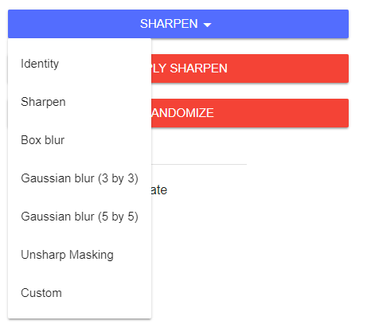

The default filter is "sharpen," which increases the crispness of the image by emphasizing the center pixel and decreasing the value of the adjacent pixels. Six filters are currently available, but many more will be added in the future.

#### Resolution

The slider near the top of the settings area can be used to change the resolution of the input and output images displayed on the right of the screen. A lower resolution will look more pixelated, but can process faster. A higher resolution will produce a more crisp image, but may slow down the program. The "Automatically update" setting can be disabled to reduce slowdown.

Any image resolution from 8 pixels to 200 pixels can be set. This is both the width and the height of the input and output images. New images that are loaded into the program will be resized to fit this resolution.

##### 8 by 8
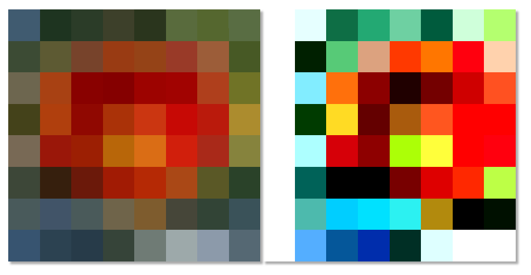

##### 50 by 50
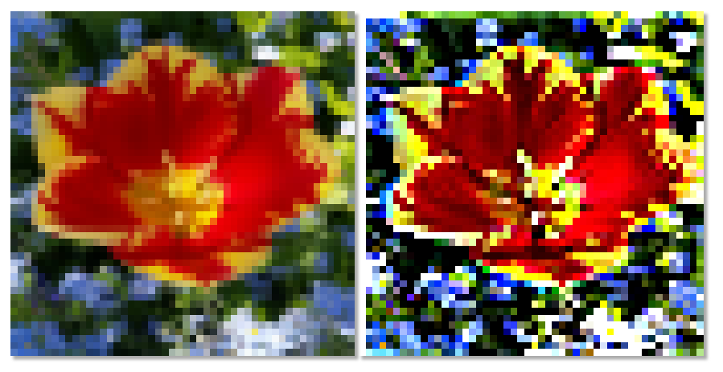

##### 200 by 200
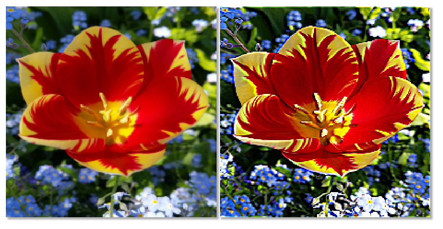

The indicator beneath the resolution slider displays the current image resolution. Hovering over the text will display a tooltip with the total area of the image in pixels.

By default, the image will be re-filtered whenever the resolution is changed. To disable this, turn off "Automatically update."

#### Repeat Filter

The "Repeat filter" setting allows you to apply the same filter to an image multiple times. Type a number of times to repeat the convolutional filter into the "Repeat filter" text field below the "Randomize" button. This can be set to any value between 1 and 100. The default value for this setting is 1. Keep in mind that the more times the filter is repeated, the longer it will take to process the image.

##### 1 filter repetition
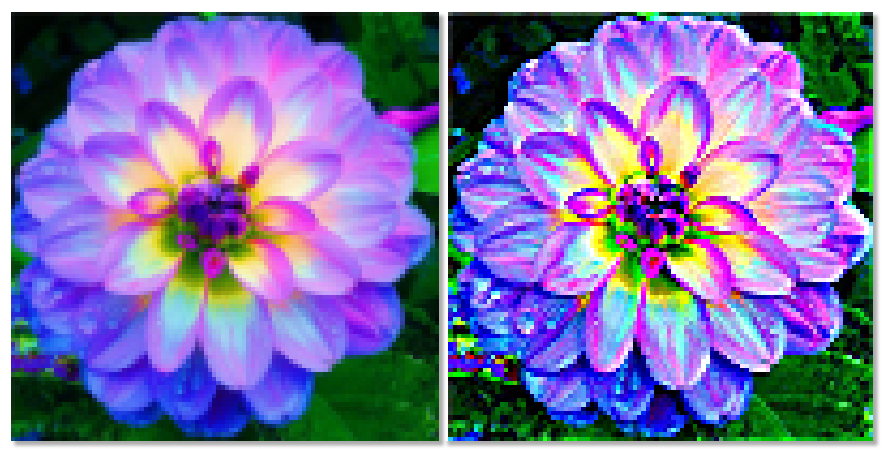

##### 2 filter repetitions
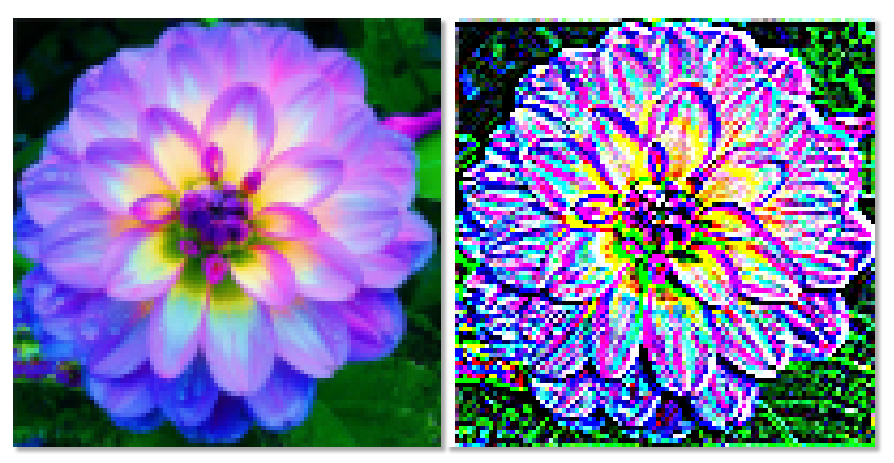

##### 3 filter repetitions
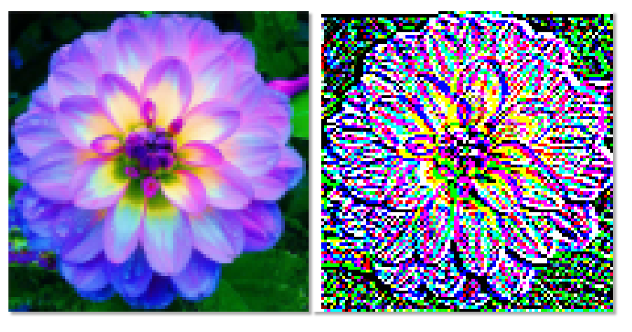

#### Randomize

The randomize button will save the currently selected filter as a custom filter, then randomize the weights of the filter. This will produce different, potentially interesting effects when applied to the input image.

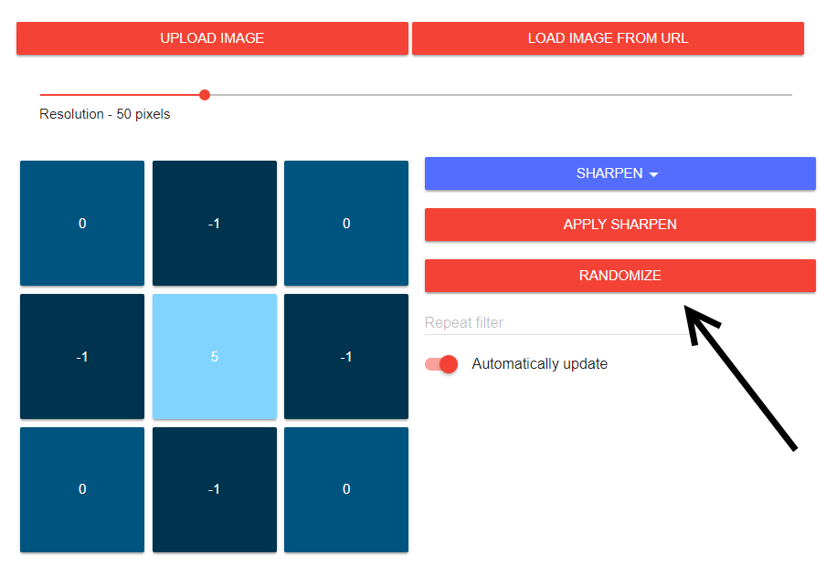

Note that many randomly generated filters may not produce meaningful results because sum of the filter kernel weights will be too large or to small. After the weights are randomized, they can be manually edited to achieve a different result.

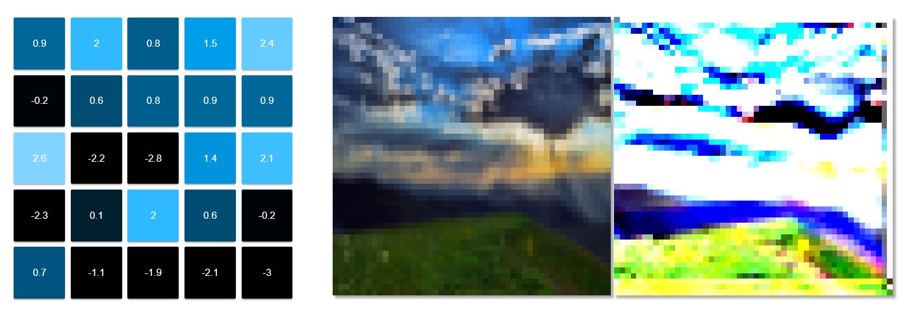

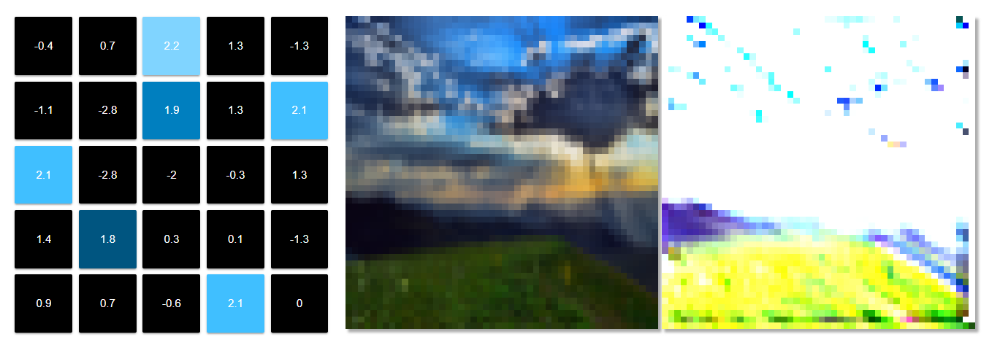

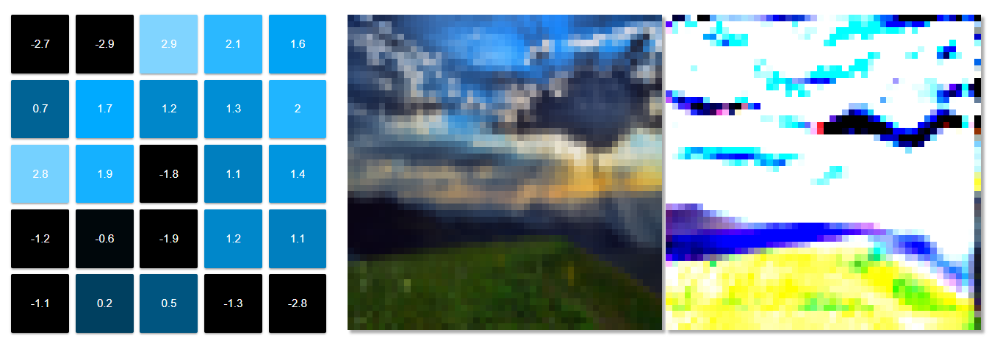

#### Automatically Update

When enabled, automatically update will re-apply the currently selected filter to the set image whenever a setting is changed.

 - Resolution changed
 - Filter kernel weights changed
 - Filter factor changed
 - Different filter is selected
 - Input image changed
 - Repeat filter setting is changed

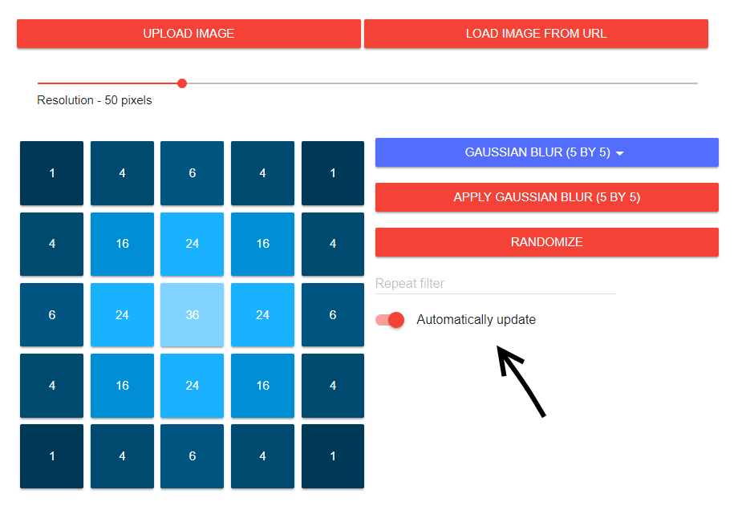

Automatically update is enabled by default. The "Apply [Filter]" button can be used to manually apply a filter when automatic updating is disabled.

#### Filter Kernel Export

The data for any filter kernel can be exported in JSON string format using the red down arrow button. Clicking this button will display a dialog box with a text box containing the filter kernel information and a red download button. You may copy and paste the kernel data from the text box or click the download button to save the filter kernel information to your computer as a text file. This exported kernel data may be imported later using the filter kernel import button.

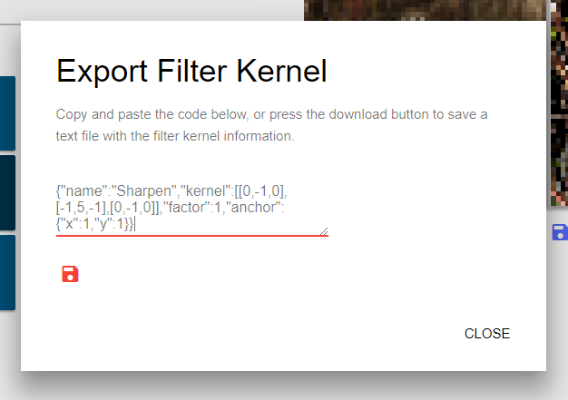

#### Filter Kernel Import

Valid filter kernel patterns can be imported using the red up arrow button. The button displays a dialog box with a text box. Filter kernel data can be entered into this text box as a JSON string. Clicking "Import" will add the kernel to the filter kernel list and apply it to the currently loaded image. Filter pattern information can be created using the Filter Kernel Export button.

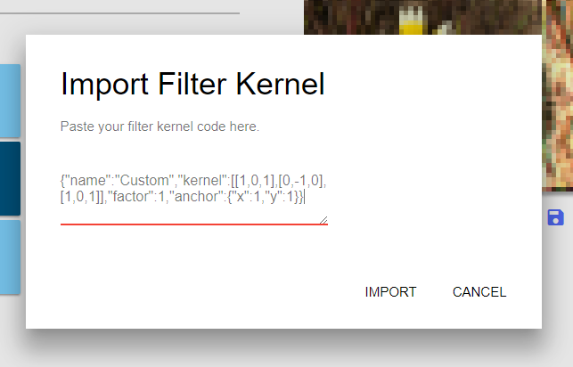

#### Image Download

Both the unprocessed input image and the processed output image can be easily downloaded using the download button beneath each image. Clicking on one of these buttons will download the appropriate image in `.png` format as `image.png` (a suffix will be added for repeated downloads; `image (1).png`). Downloaded images can be re-uploaded through the "Upload Image" button.

### To-do

Many features are still planned to make this project even better.

 - [Image download option](https://github.com/generic-github-user/Image-Convolution-Playground/issues/13)
 - [Saving settings, images, and custom filter kernels in the browser](https://github.com/generic-github-user/Image-Convolution-Playground/issues/3)

See the [issues page](https://github.com/generic-github-user/Image-Convolution-Playground/issues) for more information.

### Resources

#### Filters

Sources of convolutional filter kernels used in this demo.

- https://en.wikipedia.org/wiki/Kernel_(image_processing)
  - Sharpen
  - Box blur
  - Gaussian blur
    - 3 by 3
    - 5 by 5
  - Unsharp masking

#### Code

##### Libraries

The libraries used for the demo.

 - [jQuery](https://jquery.com/)
 - [Material Design Lite](https://getmdl.io/)
 - [download.js by dandavis](http://danml.com/download.html)

##### Snippets

 - [Read image data from file upload](https://stackoverflow.com/a/22369599)
 - [Get maximum value from matrix](https://stackoverflow.com/a/39342975)
 - [Set element's height to be equal to its width](https://stackoverflow.com/a/5445536)

##### Polyfills

 - [Dialog Polyfill](https://github.com/GoogleChrome/dialog-polyfill)

## Other Notes

 - Image used for early testing of program:
https://i.imgur.com/vXiaCO3.jpg
